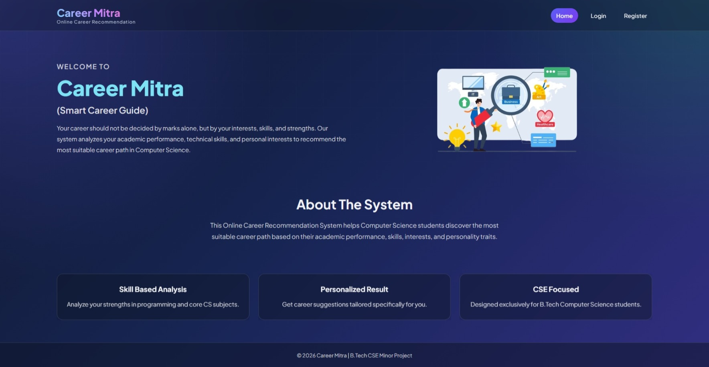
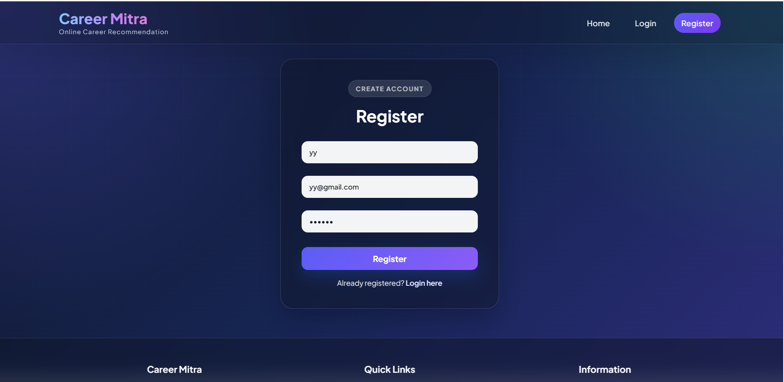
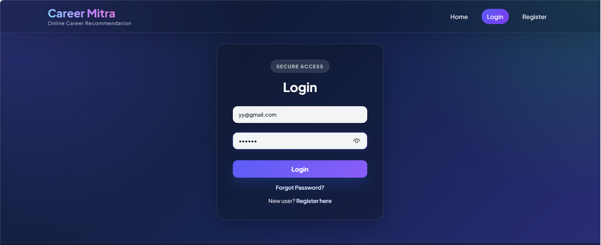
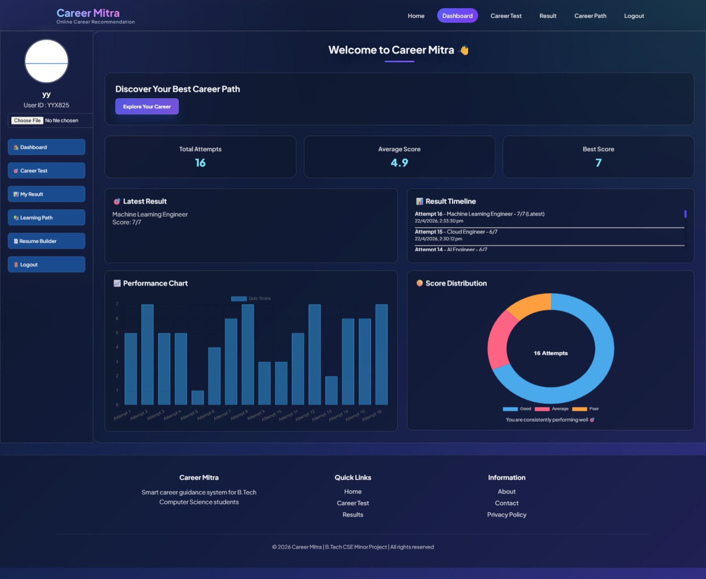
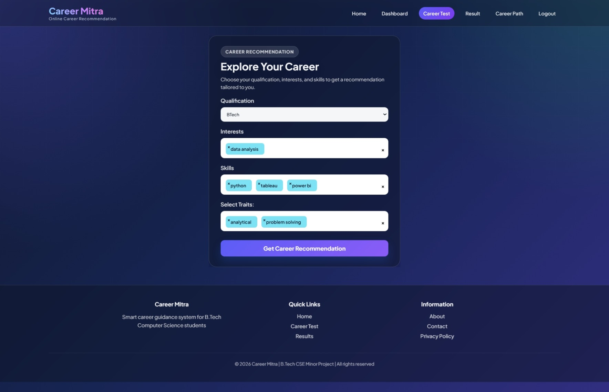
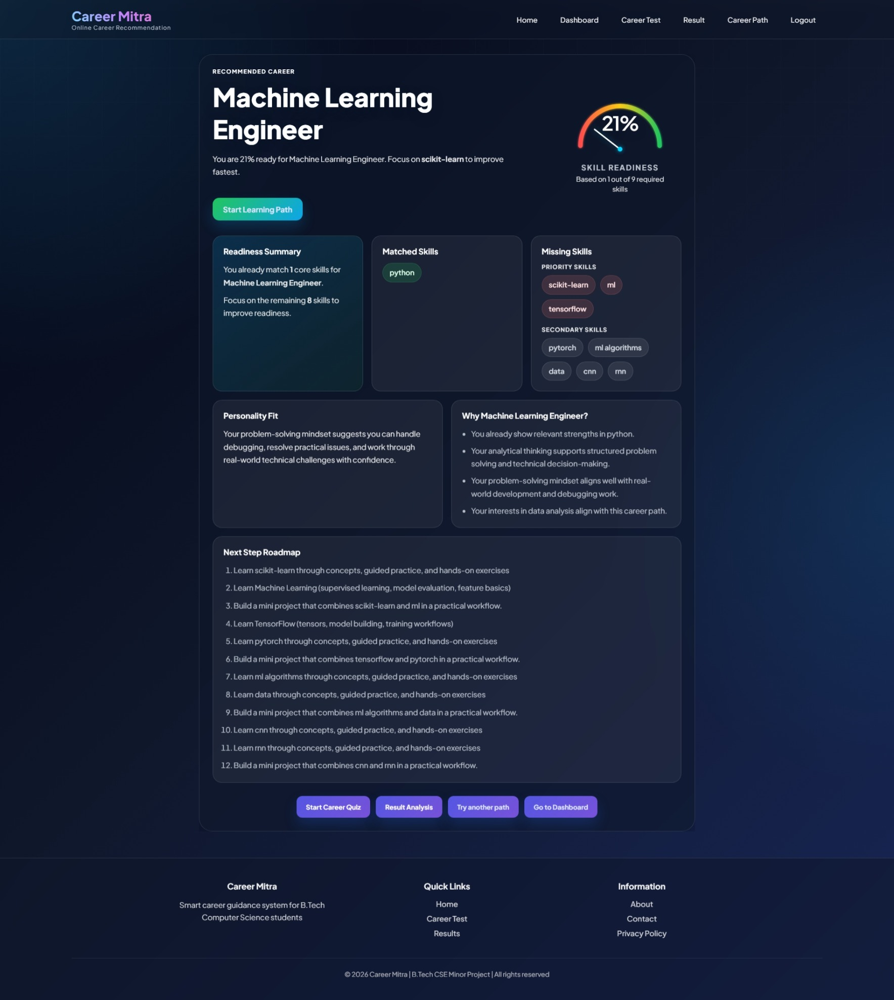
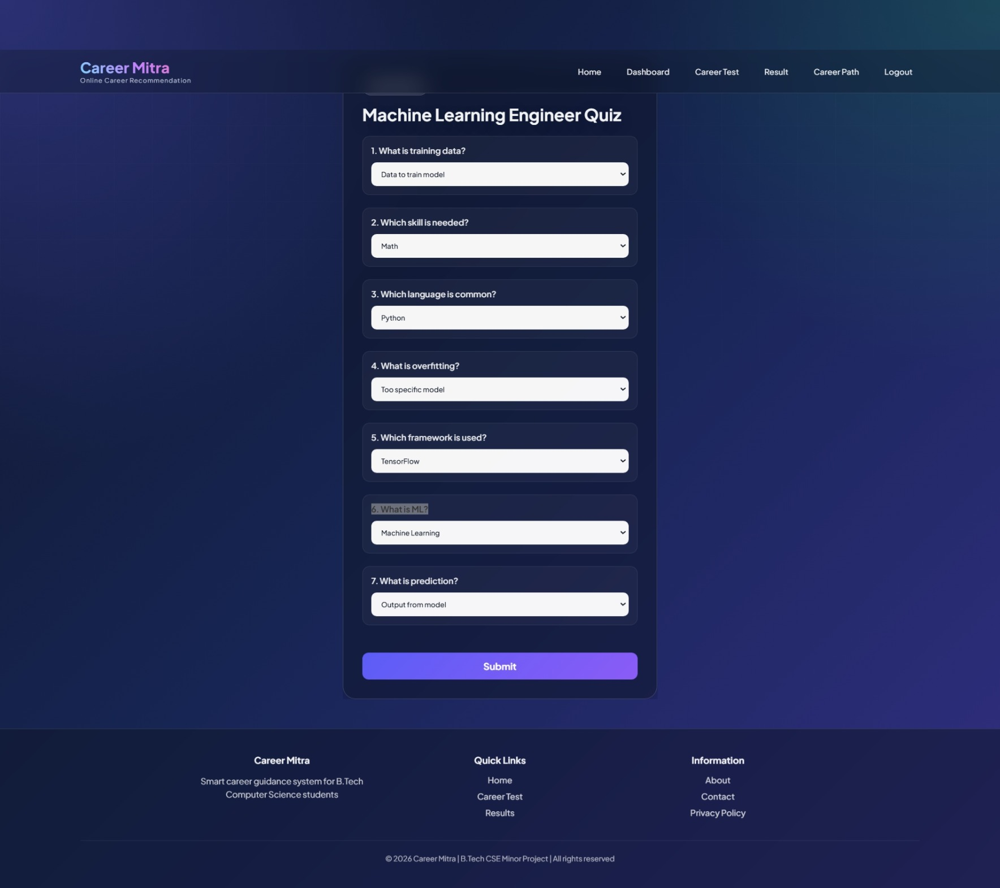
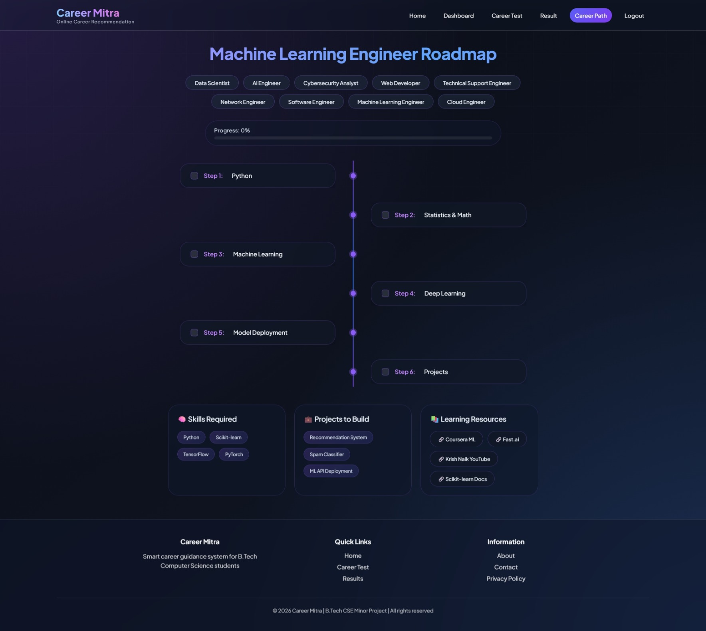
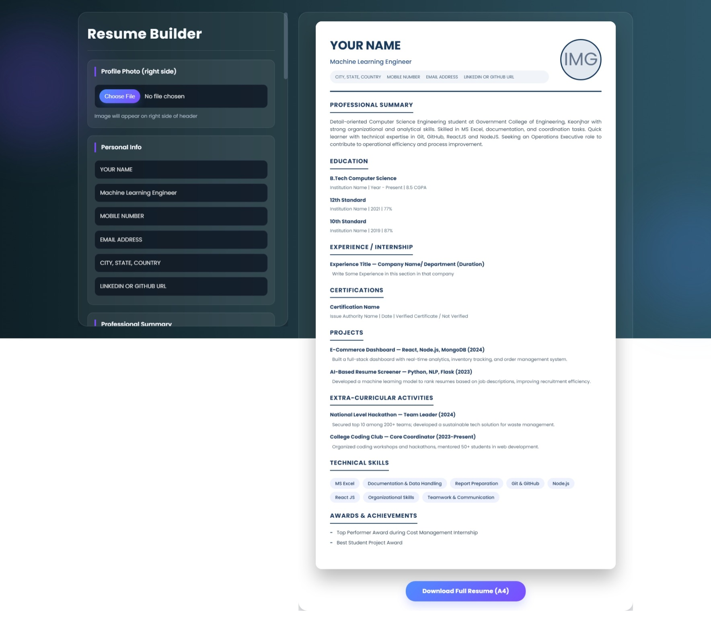

# Career Mitra 🚀

### AI-Powered Career Recommendation and Guidance Platform

Career Mitra is a full-stack career guidance web application that helps students discover suitable technology career paths based on their **qualification, technical skills, interests, and personality traits**.

The platform combines **Machine Learning-based career prediction, skill-gap analysis, career-specific quizzes, learning roadmaps, progress tracking, dashboard analytics, and resume building** in a single application.

---

## 🌐 Live Demo

**Live Application:**  
https://carrier-recommendation-system-project.onrender.com

**GitHub Repository:**  
https://github.com/Satya-Ranjan5477/career-recommendation-system

---

## Team Members
 
* Satya Ranjan Dwibedy
* Tejaswini Bhuyan
* Priyabrat pradhan
* Smruti Sourav Sahoo
* Satyabrat Parida

# 📌 Problem Statement

Choosing the right technology career can be difficult for students because different careers require different combinations of technical skills, interests, and personal characteristics.

Career Mitra addresses this problem by analyzing:

- Qualification
- Technical skills
- Interests
- Personality traits

The system uses a **Random Forest Classifier** to recommend a suitable career and then provides a personalized preparation path through skill-gap analysis, quizzes, learning roadmaps, and progress tracking.

---

## ✨ Key Features

### 🤖 Machine Learning Career Recommendation

Uses a **Random Forest Classifier** to recommend a suitable technology career based on user information.

### 📊 Skill Gap Analysis

Compares the user's existing skills with the skills required for the recommended career.

Provides:

- Matched skills
- Missing skills
- Career readiness percentage

### 📝 Career-Specific Quiz

Users can take quizzes related to their recommended career.

Includes:

- Career-specific questions
- Automatic score calculation
- Quiz analysis
- Attempt history
- Performance tracking

### 🗺️ Learning Roadmaps

Provides structured learning paths containing:

- Required skills
- Learning steps
- Project ideas
- Learning resources
- Progress tracking

### 📈 Student Dashboard

Displays:

- Total quiz attempts
- Average score
- Best score
- Latest recommendation
- Performance charts
- Quiz history
- Career recommendation history
- Learning path access

### 🔐 Authentication

Firebase Authentication provides:

- Registration
- Login
- Logout
- Password reset
- Protected application pages

### 👤 Profile Management

Users can manage their profile and upload a profile photo.

Profile images are stored using **Cloudinary**.

### 📄 Resume Builder

Users can enter their details and generate a structured resume.

---

## 🔄 Application Flow

<!-- ```text -->
                         Student
                            │
                            ▼
                    Register / Login
                            │
                            ▼
                  Career Assessment
                            │
             ┌──────────────┼──────────────┐
             ▼              ▼              ▼
       Qualification     Skills       Interests
                            │
                         Traits
                            │
                            ▼
                  Random Forest Model
                            │
                            ▼
                  Career Recommendation
                            │
                            ▼
                   Skill Gap Analysis
                            │
                            ▼
                   Readiness Score
                            │
          ┌─────────────────┼─────────────────┐
          ▼                 ▼                 ▼
     Career Quiz      Learning Roadmap     Dashboard
          │                 │                 │
          ▼                 ▼                 ▼
    Quiz History     Progress Tracking    Analytics
          │                 │                 │
          └─────────────────┼─────────────────┘
                            ▼
                       MongoDB Atlas

---
## 🖥️ Screenshots

### Home Page



### Registration



### Login



### Dashboard



### Career Assessment



### Career Recommendation




### Career Quiz



### Career Roadmap



### Resume Builder



---
## 🏗️ System Architecture


                         USER
                           │
                           ▼
                ┌────────────────────┐
                │   HTML / CSS / JS  │
                │      Frontend      │
                └─────────┬──────────┘
                          │
                          ▼
                ┌────────────────────┐
                │       Flask        │
                │      Backend       │
                └─────────┬──────────┘
                          │
             ┌────────────┼────────────┐
             │            │            │
             ▼            ▼            ▼
       ┌──────────┐  ┌──────────┐  ┌────────────┐
       │ Random   │  │ MongoDB  │  │ Cloudinary │
       │ Forest   │  │  Atlas   │  │   Storage  │
       │ ML       │  │ Database │  │            │
       └────┬─────┘  └────┬─────┘  └─────┬──────┘
            │             │              │
            ▼             ▼              ▼
       Prediction     User Data     Profile Photos
            │
            ▼
    ┌──────────────────────────────┐
    │      Career Mitra Services   │
    ├──────────────────────────────┤
    │ Career Recommendation        │
    │ Skill Gap Analysis           │
    │ Readiness Score              │
    │ Career Quiz                  │
    │ Learning Roadmap             │
    │ Dashboard Analytics          │
    │ Resume Builder               │
    └──────────────────────────────┘

                  Firebase
                Authentication
                      │
                      ▼
                User Identity
---   

## 🛠️ Technology Stack

| Category            | Technologies                |
| ------------------- | --------------------------- |
| Frontend            | HTML, CSS, JavaScript       |
| Charts              | Chart.js                    |
| Backend             | Python, Flask               |
| Machine Learning    | Scikit-learn, Random Forest |
| Data Processing     | Pandas, NumPy               |
| Model Serialization | Joblib                      |
| Authentication      | Firebase Authentication     |
| Database            | MongoDB Atlas               |
| Image Storage       | Cloudinary                  |
| Production Server   | Gunicorn                    |
| Deployment          | Render                      |
| Version Control     | Git, GitHub                 |

---
## 🤖 Machine Learning

Career Mitra uses a **Random Forest Classifier** for career recommendation.

### Input Features:

The model considers four categories of user information:

- Qualification
- Technical skills
- Interests
- Personality traits

### Prediction Pipeline:


          User Input
              │
              ▼
          Data Encoding
              │
              ▼
          Feature Transformation
              │
              ▼
          Random Forest Classifier
              │
              ▼
          Career Recommendation
              │
              ▼
          Skill Gap Analysis
              │
              ▼
          Readiness Score

---
### Model Files:

The trained model and preprocessing encoders are stored using **Joblib**.

The files represent :-

| File | Purpose |
|---|---|
| `model.pkl` | Trained Random Forest model |
| `le_q.pkl` | Qualification encoder |
| `le_c.pkl` | Career label encoder |
| `mlb_skills.pkl` | Skills multi-label encoder |
| `mlb_interests.pkl` | Interests multi-label encoder |
| `mlb_traits.pkl` | Personality traits multi-label encoder |

---
### 🗄️ Database

Career Mitra uses MongoDB Atlas for persistent application data.

The application uses the following collections:

| Collection | Purpose | Key Data |
|---|---|---|
| `students` | Stores user and profile information | Firebase UID, User ID, Name, Email, Profile photo URL |
| `quiz_attempts` | Stores career quiz performance | Career, Score, Total questions, Percentage, Quiz analysis, Completion date |
| `career_recommendations` | Stores previous career recommendations | Qualification, Skills, Interests, Traits, Predicted career, Skill-gap information, Creation date |
| `career_progress` | Stores learning roadmap progress | Firebase UID, Career, Completed learning steps, Progress information |

---
## 📁 Project Structure

```bash
carrier-recommendation-system-project/
│
├── app.py
├── predict.py
├── skill_gap.py
├── quiz_data.py
├── career_path_data.py
├── carrier_skill_catalog.py
├── career_data.csv
├── train_model.py
│
├── model.pkl
├── le_q.pkl
├── le_c.pkl
├── mlb_skills.pkl
├── mlb_interests.pkl
├── mlb_traits.pkl
│
├── database/
│   ├── __init__.py
│   └── mongodb.py
│
├── services/
│   ├── career_service.py
│   ├── quiz_service.py
│   └── student_service.py
│
├── templates/
│
├── static/
│
├── screenshots/
│
├── requirements.txt
├── Procfile
├── .gitignore
└── README.md
```
---
## 🚀 Run Locally

## 1.Clone repository:

```bash
git clone https://github.com/Satya-Ranjan5477/career-recommendation-system.git
cd career-recommendation-system
```

## 2.Create a Virtual Enviornment:

### Windows
```bash
python -m venv venv
venv\Scripts\activate
```

### Linux/MacOS
```bash
python3 -m venv venv
source venv/bin/activate
```

## 3.Install dependencies:

```bash
pip install -r requirements.txt
```

## 4.Configure Environment Variables:

Create a *.env* file in the project root.

```text

FLASK_SECRET_KEY=your_secret_key
FIREBASE_API_KEY=your_firebase_api_key
FIREBASE_AUTH_DOMAIN=your_project.firebaseapp.com
FIREBASE_PROJECT_ID=your_project_id
FIREBASE_STORAGE_BUCKET=your_storage_bucket
FIREBASE_MESSAGING_SENDER_ID=your_messaging_sender_id
FIREBASE_APP_ID=your_firebase_app_id

MONGO_URI=your_mongodb_connection_string
MONGO_DB_NAME=career_mitra

CLOUDINARY_CLOUD_NAME=your_cloudinary_cloud_name
CLOUDINARY_API_KEY=your_cloudinary_api_key
CLOUDINARY_API_SECRET=your_cloudinary_api_secret
```

## 5.Run application:

```bash
python app.py
```

Open:

```bash
http://127.0.0.1:5000
```

---

## 🔐 Environment Variables & Secrets

Career Mitra uses environment variables for sensitive configuration.

The .env file contains:

-Flask secret key
-Firebase configuration
-MongoDB connection string
-Cloudinary credentials

The .env file is excluded using .gitignore.

## ☁️ Deployment on Render

Career Mitra is deployed using Render. 

Build Command:

```bash
pip install -r requirements.txt
```

Start Command:

```bash
gunicorn app:app
```

### Production Services
| Service | Purpose |
| --- | --- |
| Render | Application hosting |
| Gunicorn | Production WSGI server |
| MongoDB Atlas | Database |
| Firebase Authentication | User authentication |
| Cloudinary |	Profile image storage |


Production URL :
https://carrier-recommendation-system-project.onrender.com

---

## 🧪 Testing

Career Mitra was tested for functionality, API reliability, and performance.

### Functional Testing

The following workflows were tested successfully:

- User registration and login
- Career recommendation
- Skill-gap analysis
- Career quiz and history
- Learning roadmap and progress tracking
- Dashboard
- Profile photo upload

### Performance Testing

Performance testing was performed using **k6** on the deployed application.

The homepage was tested with up to **50 concurrent virtual users for 30 seconds**.

| Virtual Users | Requests | Failure Rate | Average Response |
|---:|---:|---:|---:|
| 5 | 110 | 0% | ~367 ms |
| 10 | 221 | 0% | ~365 ms |
| 25 | 551 | 0% | ~363 ms |
| 50 | 1088 | 0% | ~364 ms |

All tested requests completed successfully with **0% request failures**.

## 🔒 Security & Production Readiness

The application includes:

- Firebase Authentication
- Protected Flask routes
- Session-based authentication
- Server-side request validation
- Environment variables for sensitive configuration
- `.env` excluded from Git
- MongoDB authentication
- MongoDB Atlas network restrictions
- User-specific database records
- Unique database indexes for data integrity
- Cloudinary-based production image storage

MongoDB Atlas network access is restricted to the required production environment rather than allowing unrestricted public access.

## Supported Career Domains

Includes recommendations for careers such as:

* Data Scientist
* Web Developer
* AI Engineer
* Cybersecurity Analyst
* Cloud Engineer
* UI/UX Designer
* Mobile App Developer
* Game Developer
* DevOps Engineer
* Blockchain Developer
* Data Analyst
* Machine Learning Engineer
* Software Engineer
* System Administrator
* Software Tester
* AR/VR Developer
* Embedded Engineer
* Network Engineer
* Technical Support Engineer
* Product Manager

---

## 🔮 Future Enhancements

Possible future improvements include:

* Larger and more diverse career datasets
* More personalized learning recommendations
* Advanced career comparison
* Job and internship recommendations
* AI-assisted resume improvement


